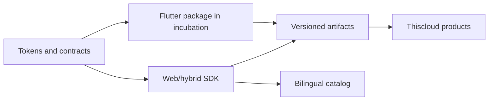

# Thiscloud UI Aurora

> **Design once. Verify always. Ship with confidence.**

Accessible, versioned, and verifiable UI foundations for building Thiscloud products without duplicating visual decisions.

[Explore the catalog](https://ui.thiscloud.com.ar) · [Download the web RC](https://ui.thiscloud.com.ar/downloads/) · [Documentation](docs/README.md) · [Español](README.md)

[](https://github.com/mdesantis1984/thiscloud-ui/actions/workflows/ci.yml) `repository: @thiscloud/ui-web 0.1.0-rc.3` · `public release: rc.1` · 4 verified API boundaries · 71 documentation routes · ES/EN

## A shared foundation, not another component collection

Aurora centralizes tokens, behavior, accessibility, documentation, and distribution in an independent repository. Products consume versioned artifacts instead of copying source code or solving the same controls, forms, and states again.

| What it provides | Why it matters |
| --- | --- |
| Verifiable contracts | Every public API must prove its behavior in a real packed consumer. |
| Bilingual catalog | Design, variants, states, and accessibility can be explored in Spanish and English. |
| Reproducible distribution | Tarball, SHA-256 checksum, and catalog come from the same revision. |
| Independent boundary | Aurora contains no product authentication, persistence, or business rules. |

## Try it in minutes

Requirements: Node.js 22, pnpm 11.13.1, and Chrome or Chromium.

```bash
pnpm install --frozen-lockfile
pnpm check:web
pnpm ui-catalog:serve
```

The catalog is available at `http://127.0.0.1:8095`. To build a local tarball for the current repository revision:

```bash
pnpm ui-web:pack
```

```js
import '@thiscloud/ui-web';
import '@thiscloud/ui-web/tokens.css';
```

```html
<tc-switch name="notifications" label="Enable notifications" value="enabled"></tc-switch>
<tc-text-field name="organization" label="Organization" required></tc-text-field>
```

## What is available today

| Surface | Actual status |
| --- | --- |
| Public web release | `@thiscloud/ui-web 0.1.0-rc.1`, available from the download site. |
| Validated web revision | `@thiscloud/ui-web 0.1.0-rc.3`: private package with `TcSwitch`, `TcTextField`, `ValidationControl`, and `attachFormValidation(nativeForm, options)`, pending publication. |
| Public catalog | 71 bilingual routes: 4 RC API boundaries and 67 design demonstrations, not published APIs. |
| Flutter `thiscloud_ui` | Private incubation package with no published runtime components or API yet. |

## Designed for trust

- Tests execute the packed web package inside a clean browser consumer.
- Published artifacts are checked against an append-only SHA-256 registry.
- The catalog container runs non-root with a read-only filesystem and explicit CPU, memory, swap, PID, and log limits.
- `main` and `develop` are protected; every human change starts from an approved issue and a verifiable PR.
- No catalog claim turns a visual demonstration into a public API.



## Explore the repository

| Path | Responsibility |
| --- | --- |
| `apps/catalog/` | Bilingual catalog, demonstrations, and public downloads. |
| `packages/ui-web/` | Framework-independent web/hybrid SDK. |
| `packages/ui_kit/` | Flutter incubation boundary. |
| `scripts/` | Build, tests, packaging, and local serving. |
| `deploy/` | Reproducible, resource-bounded catalog runtime. |
| `.github/` | Issues, CI, releases, and repository governance. |

The [documentation guide](docs/README.md) shows what is already available in Spanish and what translations remain in progress. Before contributing, read [`CONTRIBUTING.md`](CONTRIBUTING.md), [`SECURITY.md`](SECURITY.md), and the [architecture](docs/architecture.md).

## Acknowledgements

Aurora builds on open work that deserves explicit credit:

- [`IA_Buscar`](https://github.com/mdesantis1984/IA_Buscar) helped locate the official Material Symbols codepoints; the catalog verifies them against the local font's `cmap` table.
- Google's [Material Symbols](https://github.com/google/material-design-icons) is redistributed under Apache 2.0; see the [included notice](apps/catalog/assets/icons/MATERIAL-SYMBOLS-APACHE-2.0.txt).
- [Inter](https://github.com/rsms/inter) and [Manrope](https://fonts.google.com/specimen/Manrope) are used under the SIL Open Font License 1.1; see the [Inter notices](packages/ui_kit/THIRD_PARTY_NOTICES.md) and [Manrope license](apps/catalog/assets/fonts/MANROPE-OFL.txt).
- Flutter, Dart, Node.js, pnpm, esbuild, Playwright, Docker, Nginx, and GitHub Actions make the verifiable development and delivery chain possible.

Applicable licenses and provenance records live next to each package or asset. These acknowledgements do not replace their legal texts.

## Contribute

Contributions are welcome when they preserve accessibility, public boundaries, and executable evidence. Start with an [issue](https://github.com/mdesantis1984/thiscloud-ui/issues) and follow [`CONTRIBUTING.md`](CONTRIBUTING.md).
