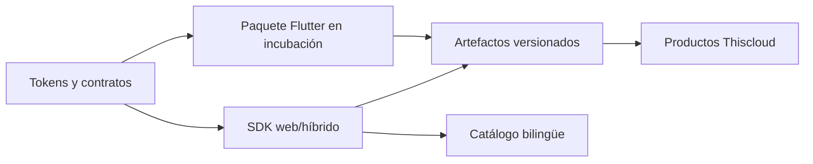

# Thiscloud UI Aurora

> **Diseña una vez. Verifica siempre. Distribuye con confianza.**

Fundamentos de interfaz accesibles, versionados y verificables para construir productos Thiscloud sin duplicar decisiones visuales.

[Explorar el catálogo](https://ui.thiscloud.com.ar) · [Descargar la RC web](https://ui.thiscloud.com.ar/downloads/) · [Documentación](docs/README.md) · [English](README.en.md)

[](https://github.com/mdesantis1984/thiscloud-ui/actions/workflows/ci.yml) `repositorio: @thiscloud/ui-web 0.1.0-rc.3` · `versión pública: rc.1` · 4 contratos de API verificados · 71 rutas documentales · ES/EN

## Una base compartida, no otra colección de componentes

Aurora concentra tokens, comportamiento, accesibilidad, documentación y distribución en un repositorio independiente. Los productos consumen artefactos versionados; no copian código fuente ni vuelven a resolver los mismos controles, formularios y estados.

| Lo que aporta | Por qué importa |
| --- | --- |
| Contratos verificables | Cada API pública debe demostrar su comportamiento en un consumidor empaquetado real. |
| Catálogo bilingüe | Diseño, variantes, estados y accesibilidad pueden explorarse en español e inglés. |
| Distribución reproducible | Tarball, suma de verificación SHA-256 y catálogo nacen de la misma revisión. |
| Frontera independiente | Aurora no incorpora autenticación, persistencia ni reglas de negocio de los productos. |

## Probarlo en minutos

Requisitos: Node.js 22, pnpm 11.13.1 y Chrome o Chromium.

```bash
pnpm install --frozen-lockfile
pnpm check:web
pnpm ui-catalog:serve
```

El catálogo queda disponible en `http://127.0.0.1:8095`. Para generar un tarball local de la revisión actual:

```bash
pnpm ui-web:pack
```

```js
import '@thiscloud/ui-web';
import '@thiscloud/ui-web/tokens.css';
```

```html
<tc-switch name="notifications" label="Activar notificaciones" value="enabled"></tc-switch>
<tc-text-field name="organization" label="Organización" required></tc-text-field>
```

## Qué está disponible hoy

| Superficie | Estado real |
| --- | --- |
| Versión web pública | `@thiscloud/ui-web 0.1.0-rc.1`, disponible en el sitio de descargas. |
| Revisión web validada | `@thiscloud/ui-web 0.1.0-rc.3`: paquete privado con `TcSwitch`, `TcTextField`, `ValidationControl` y `attachFormValidation(nativeForm, options)`, pendiente de publicación. |
| Catálogo público | 71 rutas bilingües: 4 contratos de API RC y 67 demostraciones de diseño, no APIs publicadas. |
| `thiscloud_ui` para Flutter | Incubación privada, todavía sin componentes ni API de entorno de ejecución publicados. |

## Diseñado para poder confiar

- Las pruebas ejecutan el paquete web empaquetado dentro de un consumidor limpio de navegador.
- Los artefactos publicados se comparan con un registro histórico inmutable de sumas de verificación SHA-256.
- El contenedor del catálogo corre sin privilegios de root, con sistema de archivos de sólo lectura y límites de CPU, memoria, swap, PIDs y registros.
- `main` y `develop` están protegidas; cada cambio humano parte de un issue aprobado y de un PR verificable.
- Ninguna afirmación del catálogo convierte una demostración visual en API pública.



## Recorrer el repositorio

| Ruta | Responsabilidad |
| --- | --- |
| `apps/catalog/` | Catálogo bilingüe, demostraciones y descarga pública. |
| `packages/ui-web/` | SDK web/híbrido independiente de frameworks. |
| `packages/ui_kit/` | Frontera de incubación para Flutter. |
| `scripts/` | Compilación, pruebas, empaquetado y servidor local. |
| `deploy/` | Entorno de ejecución reproducible y acotado del catálogo. |
| `.github/` | Issues, CI, publicaciones y gobierno del repositorio. |

La [guía de documentación](docs/README.md) indica qué material ya está disponible en español y qué traducciones siguen en curso. Antes de contribuir, consulta [`CONTRIBUTING.md`](CONTRIBUTING.md), [`SECURITY.md`](SECURITY.md) y la [arquitectura](docs/architecture.md).

## Agradecimientos

Aurora se construye sobre trabajo abierto que merece crédito explícito:

- [`IA_Buscar`](https://github.com/mdesantis1984/IA_Buscar) ayudó a localizar los puntos de código oficiales de Material Symbols; el catálogo los verifica contra el mapa `cmap` de la fuente local.
- [Material Symbols](https://github.com/google/material-design-icons) de Google se redistribuye bajo Apache 2.0; consulta el [aviso incluido](apps/catalog/assets/icons/MATERIAL-SYMBOLS-APACHE-2.0.txt).
- [Inter](https://github.com/rsms/inter) y [Manrope](https://fonts.google.com/specimen/Manrope) se utilizan bajo SIL Open Font License 1.1; consulta los [avisos de Inter](packages/ui_kit/THIRD_PARTY_NOTICES.md) y la [licencia de Manrope](apps/catalog/assets/fonts/MANROPE-OFL.txt).
- Flutter, Dart, Node.js, pnpm, esbuild, Playwright, Docker, Nginx y GitHub Actions hacen posible la cadena verificable de desarrollo y entrega.

Las licencias y procedencias aplicables viven junto a cada paquete o recurso. Este agradecimiento no reemplaza sus textos legales.

## Participar

Las contribuciones son bienvenidas cuando preservan la accesibilidad, las fronteras públicas y la evidencia ejecutable. Comienza por un [issue](https://github.com/mdesantis1984/thiscloud-ui/issues) y sigue el flujo de [`CONTRIBUTING.md`](CONTRIBUTING.md).
